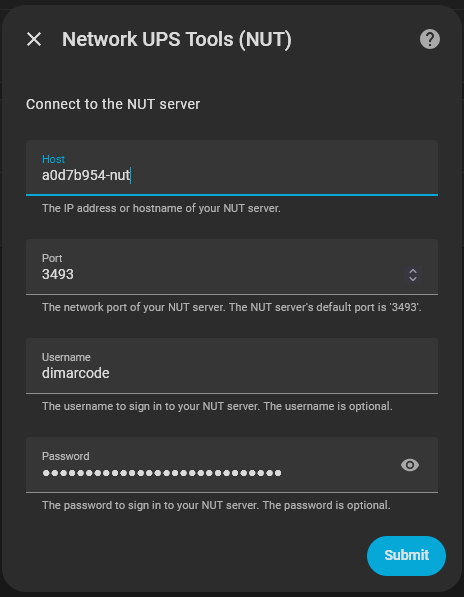

# nut-homeassistant

## NUT Home Assistant Add-On

This acts as the NUT Server

On the `Info` tab, note the Hostname, it will be needed to connect the [NUT Home Assistant Integration](#NUT%20Home%20Assistant%20Integration)


Configuration:

```yaml
users:
  - username: dimarcode
    password: "super-secret-password"
    instcmds:
      - all
    actions: []
  - username: upslave
    password: "yourpassword"
    upsmon: slave
devices:
  - name: APC-BE600M1-BackUPS
    driver: usbhid-ups
    port: auto
    config:
      - vendorid = 051d
  - name: CyberPower-CP1500VA-UPS
    driver: usbhid-ups
    port: auto
    config:
      - vendorid = 0764
mode: netserver
shutdown_host: false
```

## NUT Home Assistant Integration

To connect to NUT Server (NUT HA Add-on)


