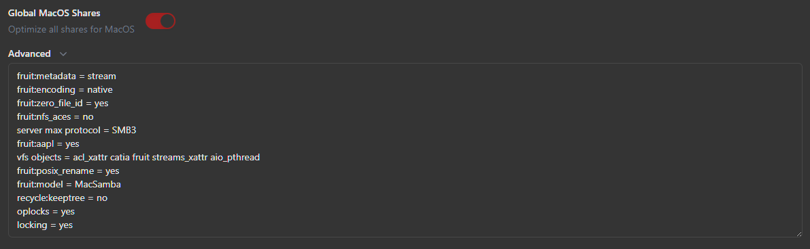
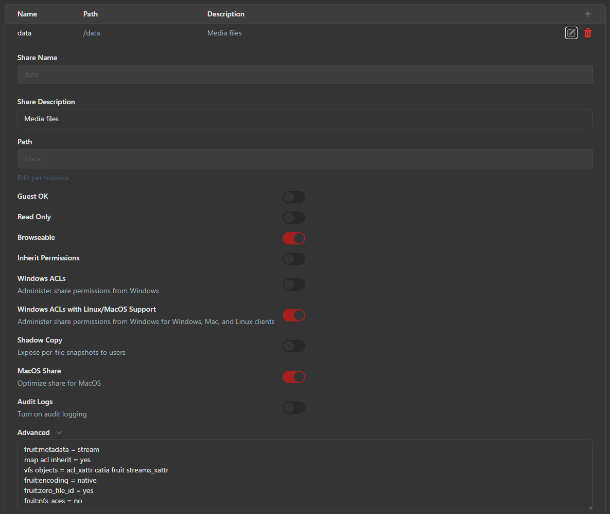
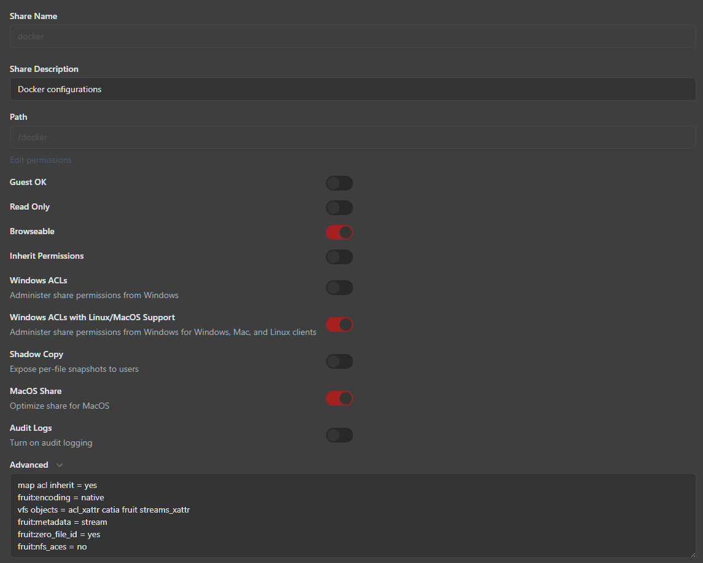
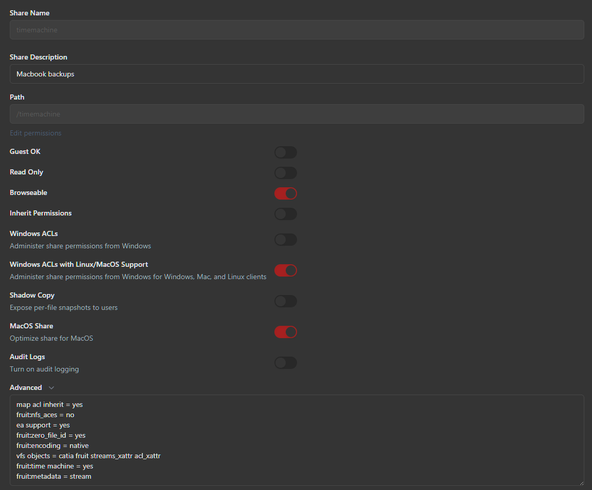
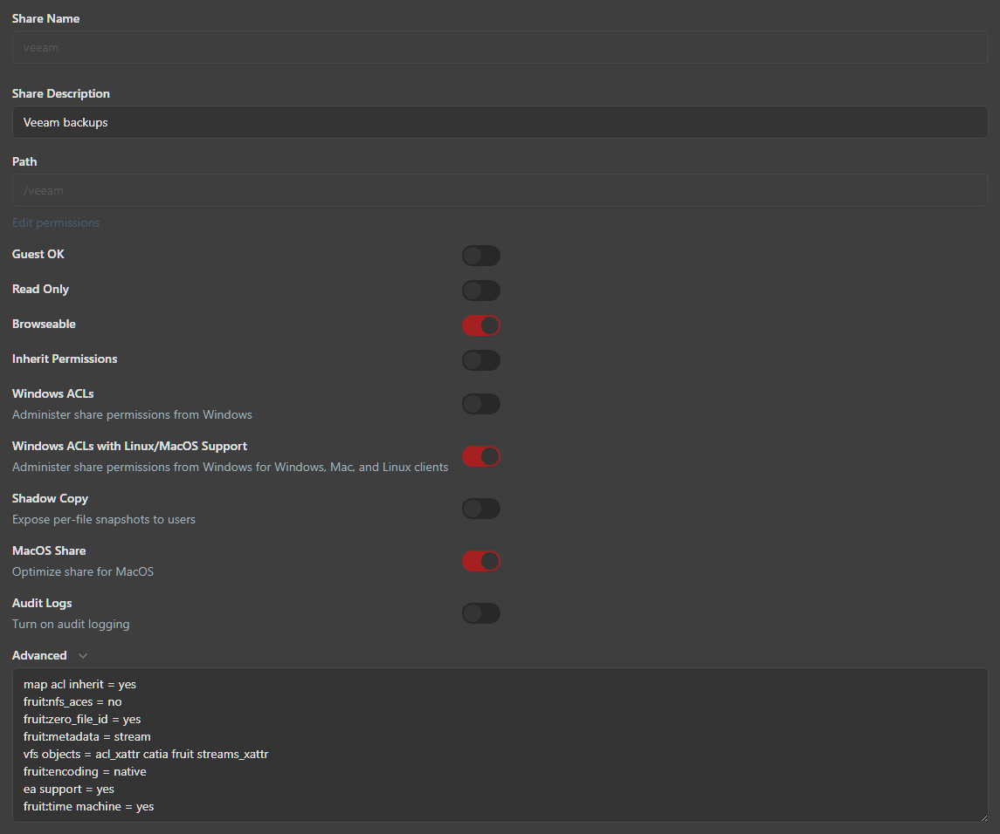

# Vault

## Overview

LXC container dedicated to storage management, i.e. serving mount points as smb shares.

## Apps

Cockpit
Rclone (for making Dropbox storage available for backrest)
Docker (for backrest)

## Shares

### GLOBAL

**Server Description:** Vault
**Workgroup:** WORKGROUP
**Log Level:** 0
**Global MacOS Shares:** Optimize all shares for MacOS: *Yes*



**Advanced:**

```bash
fruit:metadata = stream
fruit:encoding = native
fruit:zero_file_id = yes
fruit:nfs_aces = no
server max protocol = SMB3
fruit:aapl = yes
vfs objects = acl_xattr catia fruit streams_xattr aio_pthread
fruit:posix_rename = yes
fruit:model = MacSamba
recycle:keeptree = no
oplocks = yes
locking = yes
```

### /data

#### Purpose

Mass storage for personal media files

#### LXC Mount Point

**PVE:** tank
**Mount Point:** /data

##### /etc/pve/lxc/100.conf

```
mp4: tank:subvol-100-disk-0,mp=/data,backup=1,size=12000G
```

#### Share config (cockpit)

**Name:** data
**Path:** /data
**Description:** Media files



**Advanced:**

```bash
fruit:metadata = stream
map acl inherit = yes
vfs objects = acl_xattr catia fruit streams_xattr
fruit:encoding = native
fruit:zero_file_id = yes
fruit:nfs_aces = no
```

### /docker

#### Purpose

- Fast storage for docker containers
	- Ex. config, media that needs fast access (images, game files, etc)

#### LXC Mount Point

**PVE:** flash
**Mount Point:** /docker

##### /etc/pve/lxc/100.conf

```bash
mp1: flash:vm-102-disk-1,mp=/docker,backup=1,size=128G
```

#### Share config (cockpit)

**Name:** docker
**Path:** /docker
**Description:** Docker configurations



**Advanced:**

```bash
map acl inherit = yes
fruit:encoding = native
vfs objects = acl_xattr catia fruit streams_xattr
fruit:metadata = stream
fruit:zero_file_id = yes
fruit:nfs_aces = no
```

### /timemachine

#### Purpose

Mass HDD storage for Time Machine backups of MacBook Pro

#### LXC Mount Point

**PVE:** tank
**Mount Point:** /timemachine

##### /etc/pve/lxc/100.conf

```bash
mp2: tank:subvol-100-disk-2,mp=/timemachine,size=4000G
```

#### Share config (cockpit)

**Name:** timemachine
**Path:** /timemachine
**Description:** Macbook backups



**Advanced:**

```bash
map acl inherit = yes
fruit:nfs_aces = no
ea support = yes
fruit:zero_file_id = yes
fruit:encoding = native
vfs objects = catia fruit streams_xattr acl_xattr
fruit:time machine = yes
fruit:metadata = stream
```

### /veeam

#### Purpose

- Mass HDD storage for Veeam backups of physical Windows 11 client

#### LXC Mount Point

**PVE:** tank
**Mount Point:** /veeam

##### /etc/pve/lxc/100.conf

```bash
mp0: tank:subvol-100-disk-1,mp=/veeam,size=8000G
```

#### Share config (cockpit)

**Name:** veeam
**Path:** /veeam
**Description:** Veeam backups



**Advanced:**

```bash
map acl inherit = yes
fruit:nfs_aces = no
fruit:zero_file_id = yes
fruit:metadata = stream
vfs objects = acl_xattr catia fruit streams_xattr
fruit:encoding = native
ea support = yes
fruit:time machine = yes
```
