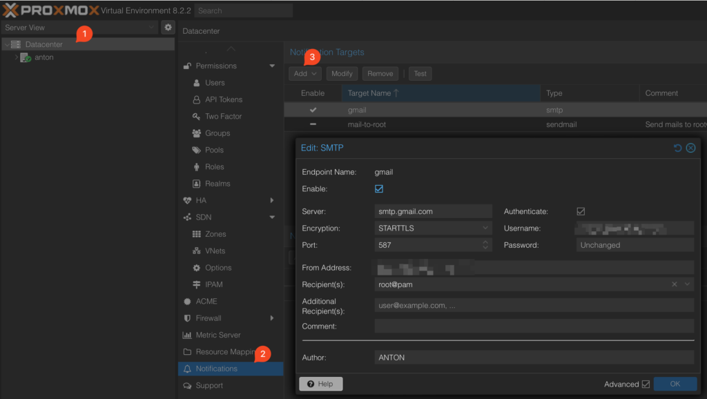
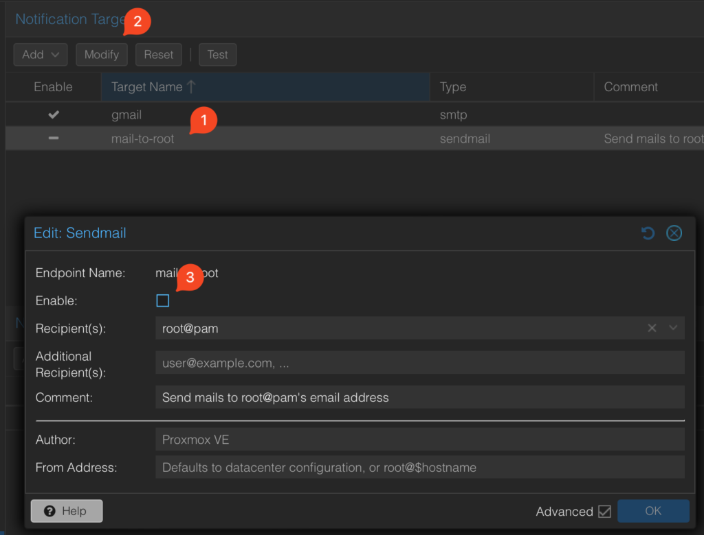
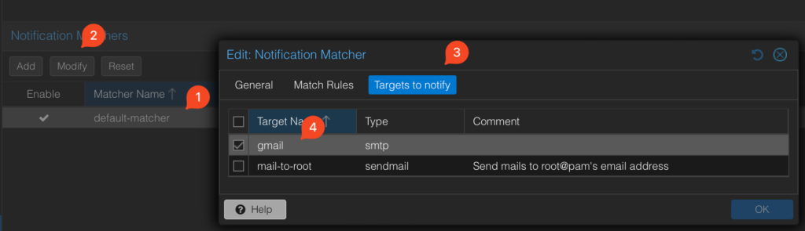

# Enable Proxmox Notifications via GMAIL

All credit to SelfHostBlog.com [Link](https://www.selfhostblog.com/enable-proxmox-notifications-via-gmail/)

## Generate SMTP Password in GMAIL

## Enable 2-Step Verification

Before setting up SMTP using an app password, it’s crucial to enhance the security of your Gmail account. Start by enabling 2-step verification:

- Visit your Google Account settings at [https://myaccount.google.com/](https://myaccount.google.com/).
- Sign in to the Gmail account you want to use for SMTP.
- Navigate to “Security” in the left sidebar.
- Under “Signing in to Google,” find and enable 2-step verification. Follow the on-screen instructions to set it up with your phone number or an authenticator app.

## Generate an App Password

- After enabling 2-step verification, proceed to generate an app-specific password:
- In the “Security” section, click on “App passwords” or search it for the top search bar and click on it.
- Provide a custom name for the app, like “SMTP for My Email Client.”
- Click the “Create” button to create a unique 16-character app-specific password.
- Copy the generated app-specific password to your clipboard. You’ll need it for configuring your email client.

# Configure Proxmox Notifications

Go to `Datacenter`, scroll down to `Notifications` and click `Add`:

Enter `smtp.gmail.com` and the Server, your email as the Username, `STARTTLS` as the Encryption, `587` as the port number. The password will be the gmail smtp password we’ve created in the last step. Optionally, you can provide the Author field with the name of your Proxmox server – it will be used in the subject of the notification emails, allowing you to setup rules in your inbox (moving to a folder, adding a label etc.)

## Disable Mail-to-root

Having configured a custom gmail SMTP settings, we need to disable the built-in mail-to-root configuration:

## Modify the Notification Matcher

The last thing we need to do is to modify the notification matcher, so it doesn’t send notifications to the (now disabled) mail-to-root, but to our gmail SMTP:

